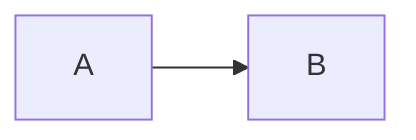
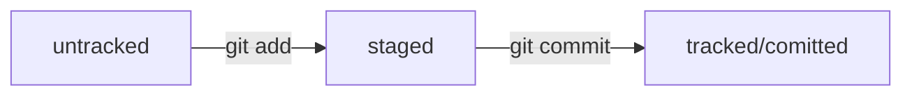

#**My first project**
## *Yandexpracticum*
### learn markdown
[Yandex](https://dzen.ru/?yredirect=true "DZEN")
```
mkdir my_project
cd my_project

```
~~iiiiiiiiiiiiiiiIIIIIII~~
* number
* name
* age
hello
--------------------------------------
bye

#**Хэш - идентификатор коммита** <br>
*Хэширование* (от англ. hash, «рубить», «крошить», «мешанина») — это способ преобразовать набор данных и получить их «отпечаток» (англ. fingerprint).<br>


#git log --oneline - получить сокращенный лог <br>
-----------------------------------------------------------
Файл HEAD (англ. «голова», «головной») — один из служебных файлов папки .git. Он указывает на коммит, который сделан последним (то есть на самый новый).<br>
-----------------------------------------------------------
#Статусы файлов в Git




