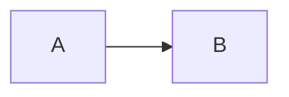

#**My fitst project**
## *Yandexpracticum*
### learn markdown
[Yandex](https://dzen.ru/?yredirect=true "DZEN")
```
mkdir my_project
cd my_project

```
~~iiiiiiiiiiiiiiiIIIIIII~~
* number
* name
* age
hello
--------------------------------------
bye

#**Хэш - идентификатор коммита** <br>
*Хэширование* (от англ. hash, «рубить», «крошить», «мешанина») — это способ преобразовать набор данных и получить их «отпечаток» (англ. fingerprint).<br>




